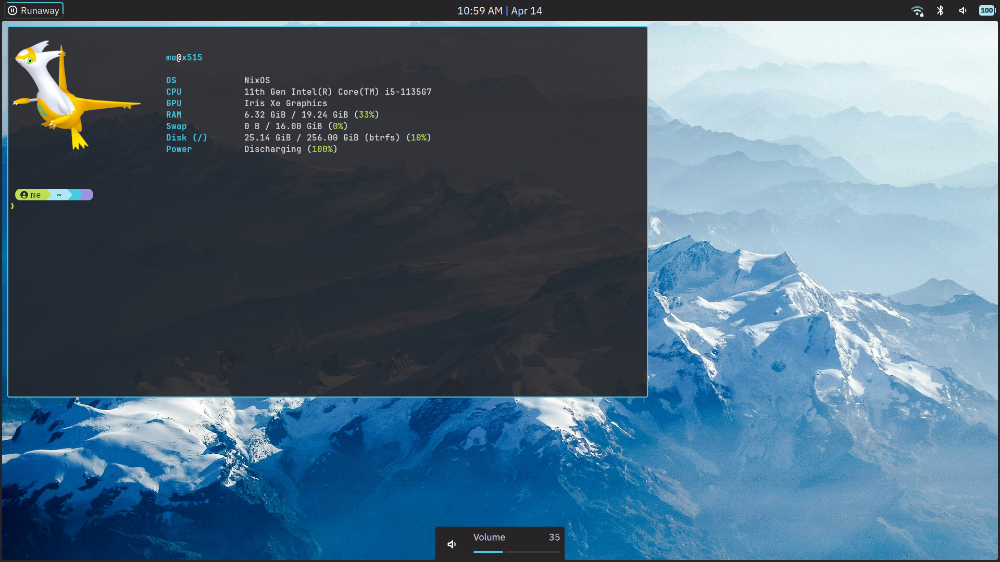

<h1 align="center">inlinefun/nix</h1>

My personal NixOS configuration.

Makes use of the following for the configuration:
- [Flakes](https://wiki.nixos.org/wiki/Flakes)
- [hjem](https://github.com/feel-co/hjem)
- [hjem-impure](https://github.com/Rexcrazy804/hjem-impure)
- [Basix](https://github.com/NotAShelf/Basix)

> dotfiles are not fully complete (yet, i think...)

Preview:

